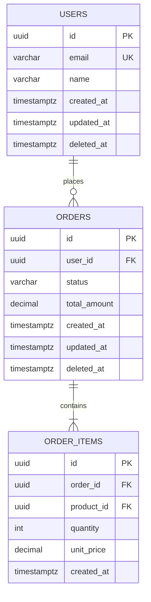

# DB Schema Designer

Designs a comprehensive database schema from business or technical requirement descriptions.
Output is always a structured Markdown document with four core sections: ERD, Migration SQL, Relation Map, and Index Recommendations.

---

## Workflow

### Phase 1 — Understand Domain & Requirements

Before writing a single line of SQL, extract the following from the user's context:

- **Domain**: What type of application is this? (e-commerce, SaaS, fintech, blog, HR system, booking platform, etc.)
- **Core entities**: Objects, actors, or concepts in the system (User, Product, Order, Reservation, etc.)
- **Entity relationships**: Who does what to whom, and in what cardinality.
- **Scale & load**: Estimated data volume, read-heavy vs. write-heavy usage patterns.
- **SQL dialect**: PostgreSQL (default), MySQL, or SQLite — ask explicitly if not stated.

If any information is missing or ambiguous, ask **at most 3 clarifying questions** before starting the design.

---

### Phase 2 — Normalization & Design Principles

Apply these principles consistently throughout every schema:

- **3NF as baseline** — eliminate data redundancy.
- **Surrogate keys (UUID or BIGSERIAL)** as primary keys — never use natural keys as PK.
- **Soft delete** via a `deleted_at TIMESTAMPTZ` column — no hard deletes on important entities.
- **Audit trail** minimum: every transactional table must carry `created_at` and `updated_at`.
- **Naming conventions**:
  - Column and table names: `snake_case`.
  - Table names: plural nouns (`users`, `orders`, `products`).
  - Foreign keys: `{referenced_table_singular}_id` pattern (e.g., `user_id`, `order_id`).
- **ENUM vs. lookup table**: Use a lookup/reference table if values may expand over time. Use ENUM only for truly fixed, immutable value sets.

---

### Phase 3 — Generate Output

Produce all **four sections** below in this exact order. Do not omit sections.
- **Language Alignment**: Write all headings, descriptions, table labels, and design notes in the user's interaction language (English if prompted in English, Indonesian if prompted in Indonesian). SQL code and technical identifiers always remain in English.

---

## Output Template

Use this template as the schema document structure. Fill each section according to the user's domain.

````markdown
# Database Schema: [Application / Domain Name]

> Dialect: PostgreSQL 15+
> Date: [YYYY-MM-DD]
> Version: 1.0.0

---

## 1. ERD (Entity Relationship Diagram)



> **Mermaid Notation Reference:**
> - `||--o{` = one-to-many (mandatory to optional)
> - `||--|{` = one-to-many (mandatory to mandatory)
> - `}|--|{` = many-to-many (expressed via junction table)
> - `||--||` = one-to-one

---

## 2. Migration SQL

> Run migrations in sequence. Each migration file is a single atomic transaction.

### Migration 001 — Extensions & Helper Functions

```sql
-- Enable UUID generation (PostgreSQL)
CREATE EXTENSION IF NOT EXISTS "pgcrypto";

-- Helper: auto-update updated_at on row modification
CREATE OR REPLACE FUNCTION trigger_set_updated_at()
RETURNS TRIGGER AS $$
BEGIN
  NEW.updated_at = NOW();
  RETURN NEW;
END;
$$ LANGUAGE plpgsql;
```

### Migration 002 — Users

```sql
CREATE TABLE users (
    id           UUID PRIMARY KEY DEFAULT gen_random_uuid(),
    email        VARCHAR(255) NOT NULL UNIQUE,
    name         VARCHAR(100) NOT NULL,
    created_at   TIMESTAMPTZ NOT NULL DEFAULT NOW(),
    updated_at   TIMESTAMPTZ NOT NULL DEFAULT NOW(),
    deleted_at   TIMESTAMPTZ
);

CREATE TRIGGER set_users_updated_at
BEFORE UPDATE ON users
FOR EACH ROW EXECUTE FUNCTION trigger_set_updated_at();
```

### Migration 003 — Orders

```sql
CREATE TYPE order_status AS ENUM ('pending', 'confirmed', 'shipped', 'completed', 'cancelled');

CREATE TABLE orders (
    id            UUID PRIMARY KEY DEFAULT gen_random_uuid(),
    user_id       UUID NOT NULL REFERENCES users(id) ON DELETE RESTRICT,
    status        order_status NOT NULL DEFAULT 'pending',
    total_amount  DECIMAL(12, 2) NOT NULL DEFAULT 0,
    notes         TEXT,
    created_at    TIMESTAMPTZ NOT NULL DEFAULT NOW(),
    updated_at    TIMESTAMPTZ NOT NULL DEFAULT NOW(),
    deleted_at    TIMESTAMPTZ
);

CREATE TRIGGER set_orders_updated_at
BEFORE UPDATE ON orders
FOR EACH ROW EXECUTE FUNCTION trigger_set_updated_at();
```

### Migration 004 — Order Items

```sql
CREATE TABLE order_items (
    id           UUID PRIMARY KEY DEFAULT gen_random_uuid(),
    order_id     UUID NOT NULL REFERENCES orders(id) ON DELETE CASCADE,
    product_id   UUID NOT NULL REFERENCES products(id) ON DELETE RESTRICT,
    quantity     INTEGER NOT NULL CHECK (quantity > 0),
    unit_price   DECIMAL(12, 2) NOT NULL CHECK (unit_price >= 0),
    created_at   TIMESTAMPTZ NOT NULL DEFAULT NOW()
);
```

---

## 3. Relation Map

| Source Table | Cardinality | Target Table | FK Column | ON DELETE | Notes |
|--------------|-------------|--------------|-----------|-----------|-------|
| `users` | 1 → N | `orders` | `orders.user_id` | RESTRICT | One user can have many orders |
| `orders` | 1 → N | `order_items` | `order_items.order_id` | CASCADE | Items are deleted when the order is deleted |
| `products` | 1 → N | `order_items` | `order_items.product_id` | RESTRICT | Products cannot be deleted if referenced in orders |

**ON DELETE Policy Reference:**
- `RESTRICT` — block delete if referenced rows still exist (safest default for important data).
- `CASCADE` — child rows are deleted alongside the parent (use for detail/child records with no standalone meaning).
- `SET NULL` — FK in child is set to NULL (use when the relationship is optional).

---

## 4. Index Recommendations

### Mandatory Indexes (High Priority)

```sql
-- FK indexes: PostgreSQL does NOT create these automatically
CREATE INDEX idx_orders_user_id ON orders(user_id);
CREATE INDEX idx_order_items_order_id ON order_items(order_id);
CREATE INDEX idx_order_items_product_id ON order_items(product_id);
```

### Query Pattern Indexes

```sql
-- Soft delete: queries commonly filter by WHERE deleted_at IS NULL
CREATE INDEX idx_users_active ON users(id) WHERE deleted_at IS NULL;
CREATE INDEX idx_orders_active ON orders(id) WHERE deleted_at IS NULL;

-- Low-cardinality status filter: partial index is more efficient
CREATE INDEX idx_orders_pending ON orders(created_at DESC)
    WHERE status = 'pending';

-- Pagination queries ordered by created_at
CREATE INDEX idx_orders_created_at ON orders(created_at DESC);
```

### Composite Indexes (for multi-column query patterns)

```sql
-- Example: find active orders by user, sorted by most recent
CREATE INDEX idx_orders_user_status ON orders(user_id, status, created_at DESC)
    WHERE deleted_at IS NULL;
```

### Index Anti-Patterns — Avoid These

| Avoid | Reason |
|-------|--------|
| Index on boolean columns (`is_active`) | Extremely low cardinality — not effective |
| Indexing every column | Over-indexing slows down write operations |
| Indexing columns that are rarely queried | Storage cost with no query benefit |
| Composite index with wrong column order | Most selective column must come first |

---

## Design Notes & Trade-offs

- **UUID vs. BIGSERIAL**: UUID is chosen for portability and distributed systems, but uses more storage (16 bytes vs. 8 bytes). Use BIGSERIAL if insert performance is critical and data is not distributed across services.
- **ENUM vs. VARCHAR**: `order_status` uses ENUM because the values are fixed and known. If statuses are user-configurable, use a separate `statuses` lookup table instead.
- **Soft delete**: `deleted_at` is preferred over `is_deleted` because it captures when the deletion occurred — far more useful for auditing and recovery.
````

---

## SQL Dialect Reference

### PostgreSQL (Default)
```sql
UUID PRIMARY KEY DEFAULT gen_random_uuid()  -- requires pgcrypto extension
TIMESTAMPTZ                                  -- always use timezone-aware timestamps
SERIAL / BIGSERIAL                           -- integer PK alternative to UUID
```

### MySQL / MariaDB
```sql
CHAR(36) PRIMARY KEY DEFAULT (UUID())       -- or BINARY(16) for storage efficiency
DATETIME DEFAULT CURRENT_TIMESTAMP
AUTO_INCREMENT
ON UPDATE CURRENT_TIMESTAMP                 -- for updated_at column
```

### SQLite
```sql
TEXT PRIMARY KEY DEFAULT (lower(hex(randomblob(4))) || '-' || ...)
INTEGER PRIMARY KEY AUTOINCREMENT
DATETIME DEFAULT CURRENT_TIMESTAMP          -- SQLite has no native datetime type
```

---

## Common Schema Patterns by Domain

Use these as references to accelerate design in familiar domains:

### E-Commerce
**Core entities**: `users`, `products`, `categories`, `orders`, `order_items`, `payments`, `addresses`, `reviews`
**Critical relations**: product ↔ category (M:N via `product_categories`), order → payment (1:1)

### SaaS Multi-Tenant
**Core entities**: `tenants`, `users`, `memberships`, `plans`, `subscriptions`, `feature_flags`
**Key pattern**: every domain table must carry a `tenant_id` FK + Row Level Security (RLS) policies in PostgreSQL.

### Blog / CMS
**Core entities**: `users`, `posts`, `categories`, `tags`, `post_tags`, `comments`, `media`
**Critical relations**: post ↔ tag (M:N via `post_tags`), comment can be self-referential (threaded comments).

### HR / Payroll
**Core entities**: `employees`, `departments`, `positions`, `contracts`, `attendances`, `payrolls`, `leaves`
**Key pattern**: `employees.manager_id` self-referential FK for organizational hierarchy.

### Fintech / Wallet
**Core entities**: `accounts`, `transactions`, `entries` (double-entry), `currencies`, `exchange_rates`
**Critical pattern**: use double-entry bookkeeping — every transaction must produce at least two `entries` (debit + credit).

### Booking / Reservation
**Core entities**: `users`, `venues`, `rooms`, `reservations`, `availability_slots`, `payments`
**Key pattern**: `availability_slots` or calendar blocking table to prevent double-booking.

---

### Phase 4 — Next Action Prompt (Interactive Migration File Creation)

After generating the complete schema document, the agent MUST ask the user for permission before writing any files:

1. Recommend a descriptive file name for the schema document (e.g. `docs/db-schema-[domain].md`).
2. Recommend individual migration file names following a standard convention (e.g. `migrations/001_create_users.sql`, `migrations/002_create_orders.sql`).
3. Ask the user whether they want the agent to automatically write the schema Markdown and/or migration SQL files to those paths.

*Interactive question example at the end of the response:*
> "Would you like me to write the schema document to `docs/db-schema-ecommerce.md` and generate the individual migration files under `migrations/`?"

**CRITICAL RULE**: Do not create any files or folders automatically. Always wait for explicit confirmation from the user before writing anything to disk.

---

## Quality Checklist

Verify these constraints before dispatching the final message:
- [ ] Every table has an explicit primary key (UUID or BIGSERIAL).
- [ ] FK indexes are explicitly created (PostgreSQL does not auto-generate them).
- [ ] `created_at` and `updated_at` are present on all transactional tables.
- [ ] `deleted_at` is present on tables requiring soft delete.
- [ ] `updated_at` trigger is attached to every applicable table.
- [ ] ON DELETE policy is deliberate and documented for each FK relationship.
- [ ] No column is nullable when it should be NOT NULL.
- [ ] ENUM is only used for truly fixed value sets.
- [ ] Partial indexes are used for soft-delete filters and low-cardinality status columns.
- [ ] Composite index column order is correct (most selective column first).
- [ ] No circular FK dependencies exist.
- [ ] All names follow snake_case convention, tables are plural, FKs follow `{table}_id` pattern.
- [ ] Output descriptions and documentation are in the user's language.
- [ ] User is asked for permission to write schema document and/or migration files to disk.
