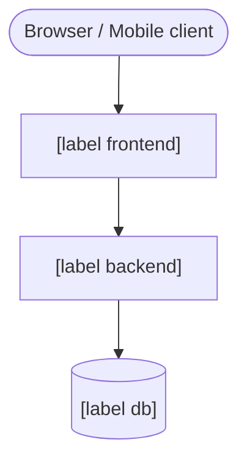
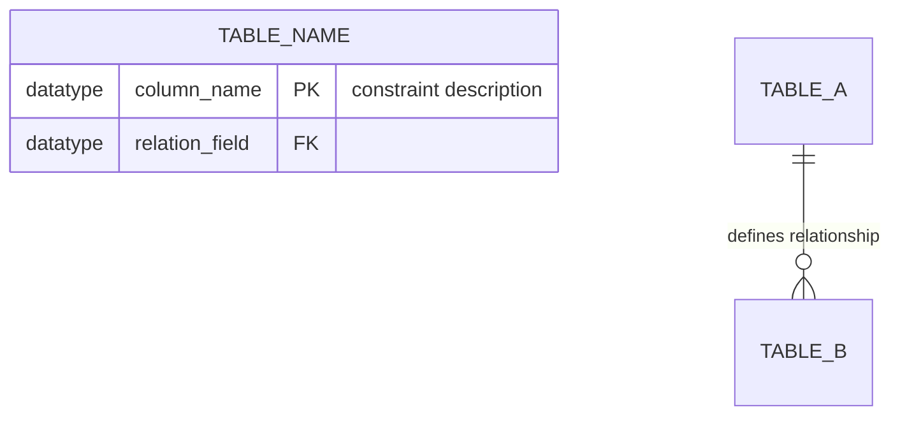
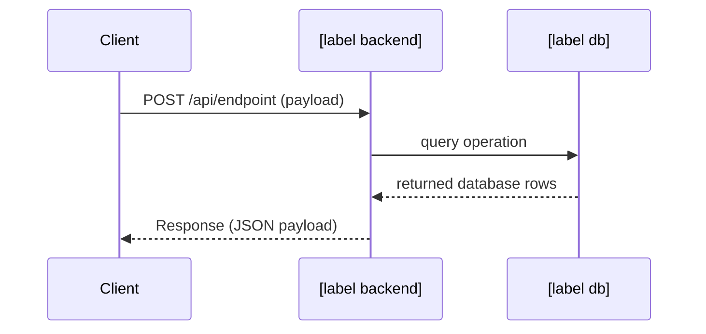
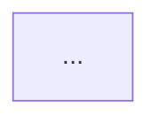

# Project Analyzer

Analyzes the codebase and generates a clean, structured Markdown knowledge document complete with Mermaid diagrams.

**The tech stack is auto-detected in Phase 0 before performing any structural reads.**

---

## Phase 0 — Stack Auto-Detection ⚡

**Must be run first. Do not proceed to Phase 1 until the [STACK] block is fully populated.**

### Detection Matrix

Scan the following files in order. First-match wins per category.

#### Primary Language (`lang`)

| File Signature / Indicator | `lang` Value |
|----------------------------|--------------|
| `go.mod` | `go` |
| `package.json` (without `go.mod`) | `node` |
| `requirements.txt` / `pyproject.toml` | `python` |
| `composer.json` | `php` |
| `pom.xml` / `build.gradle` / `build.gradle.kts` | `java` |
| `Cargo.toml` | `rust` |
| `*.csproj` / `*.sln` | `csharp` |

#### Backend Framework (`backend`)

| Indicator | `backend` Value |
|-----------|-----------------|
| `go.mod` contains `github.com/gin-gonic/gin` | `gin` |
| `go.mod` contains `github.com/labstack/echo` | `echo` |
| `go.mod` contains `github.com/gofiber/fiber` | `fiber` |
| `go.mod` contains `github.com/go-chi/chi` | `chi` |
| `go.mod` contains `github.com/gorilla/mux` | `gorilla-mux` |
| `package.json` dep: `express` | `express` |
| `package.json` dep: `fastify` | `fastify` |
| `package.json` dep: `@nestjs/core` | `nestjs` |
| `package.json` dep: `hono` | `hono` |
| `package.json` dep: `elysia` | `elysia` |
| `requirements.txt`/`pyproject.toml` dep: `fastapi` | `fastapi` |
| `requirements.txt`/`pyproject.toml` dep: `django` | `django` |
| `requirements.txt`/`pyproject.toml` dep: `flask` | `flask` |
| `composer.json` dep: `laravel/framework` | `laravel` |
| `composer.json` dep: `symfony/framework-bundle` | `symfony` |
| `pom.xml` / `build.gradle` contains `org.springframework.boot` | `spring` |
| `Cargo.toml` contains `axum` | `axum` |
| `Cargo.toml` contains `actix-web` | `actix-web` |
| `Cargo.toml` contains `rocket` | `rocket` |
| `*.csproj` contains `Microsoft.NET.Sdk.Web` | `aspnet` |
| None of the above | `none` |

#### Frontend Framework (`frontend`)

| Indicator | `frontend` Value |
|-----------|------------------|
| `nuxt.config.ts` / `nuxt.config.js` | `nuxt` |
| `next.config.ts` / `next.config.js` / `next.config.mjs` | `nextjs` |
| `package.json` dep: `@sveltejs/kit` / `svelte` | `svelte` |
| `package.json` dep: `vue` | `vue` |
| `package.json` dep: `react` | `react` |
| `package.json` dep: `@angular/core` | `angular` |
| `package.json` dep: `solid-js` | `solidjs` |
| `package.json` dep: `qwik` | `qwik` |
| None of the above | `none` |

#### ORM / Query Builder (`orm`)

| Indicator | `orm` Value |
|-----------|-------------|
| `go.mod` contains `gorm.io/gorm` | `gorm` |
| `sqlc.yaml` / `sqlc.yml` | `sqlc` |
| `go.mod` contains `jmoiron/sqlx` | `sqlx` |
| `go.mod` contains `uptrace/bun` | `bun-orm` |
| `schema.prisma` | `prisma` |
| `package.json` dep: `typeorm` | `typeorm` |
| `package.json` dep: `drizzle-orm` | `drizzle` |
| `package.json` dep: `sequelize` | `sequelize` |
| `package.json` dep: `mongoose` | `mongoose` |
| `package.json` dep: `@mikro-orm/core` | `mikro-orm` |
| `package.json` dep: `knex` | `knex` |
| `requirements.txt`/`pyproject.toml` dep: `sqlalchemy` | `sqlalchemy` |
| `requirements.txt`/`pyproject.toml` dep: `sqlmodel` | `sqlmodel` |
| `requirements.txt`/`pyproject.toml` dep: `tortoise-orm` | `tortoise` |
| Django app with `models.py` | `django-orm` |
| `composer.json` dep: `laravel/framework` (Eloquent built-in) | `eloquent` |
| `Cargo.toml` contains `diesel` | `diesel` |
| `Cargo.toml` contains `sqlx` (Rust variant) | `sqlx-rust` |
| `Cargo.toml` contains `sea-orm` | `sea-orm` |
| `migrations/` folder with `.sql` but no other ORM markers | `raw-sql` |
| None of the above | `none` |

#### Database (`db`)

| Indicator | `db` Value |
|-----------|------------|
| Config/env/deps match `postgres` / `postgresql` / `pgx` / `pg` | `postgres` |
| Config/env/deps match `mysql` / `mariadb` | `mysql` |
| Config/env/deps match `sqlite` | `sqlite` |
| Config/env/deps match `mongodb` / `mongo` | `mongodb` |
| Config/env/deps match `cassandra` | `cassandra` |
| None of the above | `none` |

#### Cache / Message Broker (`cache`)

| Indicator | `cache` Value |
|-----------|---------------|
| Config/env/deps contain `redis` | `redis` |
| Config/env/deps contain `memcached` | `memcached` |
| Config/env/deps contain `rabbitmq` / `amqp` | `rabbitmq` |
| Config/env/deps contain `kafka` | `kafka` |
| None of the above | `none` |

#### Infrastructure & CI (`infra` / `ci` / `monorepo`)

| Indicator | Value |
|-----------|-------|
| `Dockerfile` | `infra: docker` |
| `docker-compose.yml` / `.yaml` | `infra: compose` |
| `k8s/` folder / files with `kind: Deployment` | `infra: k8s` |
| `.github/workflows/` | `ci: github-actions` |
| `.gitlab-ci.yml` | `ci: gitlab-ci` |
| `Jenkinsfile` | `ci: jenkins` |
| `packages/` + `apps/` / `pnpm-workspace.yaml` / `turbo.json` | `monorepo: yes` |

### Output: STACK Block

Print this exact block after scanning. **Do not move to Phase 1 before printing this block.**

```
[STACK]
lang:     <go | node | python | php | java | rust | csharp>
backend:  <gin | echo | fiber | chi | gorilla-mux | express | fastify | nestjs | hono | elysia | fastapi | django | flask | laravel | symfony | spring | axum | actix-web | rocket | aspnet | none>
frontend: <nuxt | nextjs | vue | react | angular | svelte | solidjs | qwik | none>
orm:      <gorm | sqlc | sqlx | bun-orm | prisma | typeorm | drizzle | sequelize | mongoose | mikro-orm | knex | sqlalchemy | sqlmodel | tortoise | django-orm | eloquent | diesel | sqlx-rust | sea-orm | raw-sql | none>
db:       <postgres | mysql | sqlite | mongodb | cassandra | none>
cache:    <redis | memcached | rabbitmq | kafka | none>
infra:    <docker | compose | k8s | none>
ci:       <github-actions | gitlab-ci | jenkins | none>
monorepo: <yes | no>
[/STACK]
```

---

## Phase 1 — Reconnaissance (Initial Mapping)

Use the STACK block to filter out irrelevant directories. Do not aggressively read files. Locate the entry points.

### Entry Points per Backend / Frontend

| Stack | Common Entry Points |
|-------|--------------------|
| `gin` / `echo` / `fiber` / `chi` / `gorilla-mux` | `main.go`, `cmd/*/main.go`, `internal/` |
| `express` / `fastify` / `hono` / `elysia` | `src/index.ts`, `app.ts`, `server.ts`, `index.js` |
| `nestjs` | `src/main.ts`, `src/app.module.ts` |
| `fastapi` | `main.py`, `app/main.py`, `routers/`, `api/` |
| `django` | `manage.py`, `*/settings.py`, `*/urls.py` |
| `flask` | `app.py`, `run.py`, `application.py`, `__init__.py` |
| `laravel` | `artisan`, `app/Providers/RouteServiceProvider.php`, `routes/api.php` |
| `symfony` | `bin/console`, `config/routes.yaml`, `src/Controller/` |
| `spring` | `src/main/java/`, `*Application.java` |
| `axum` / `actix-web` / `rocket` | `Cargo.toml`, `src/main.rs`, `src/lib.rs` |
| `aspnet` | `Program.cs`, `Startup.cs` |
| `nuxt` | `nuxt.config.ts`, `app.vue`, `pages/`, `server/api/` |
| `nextjs` | `next.config.ts`, `app/`, `pages/`, `src/app/` |

### Output: RECON Block

Output this structure after mapping:

```
[RECON]
entry_points:     [comma-separated list of identified entrypoint file paths]
confirmed_stack:  [status validating stack matches actual files]
project_size:     <small (<20 files) | medium (20–100 files) | large (>100 files)>
estimated_tables: [count of anticipated DB tables]
notes:            [any notable observation or project architecture quirks]
[/RECON]
```

---

## Phase 2 — Deep Analysis

Use the STACK and RECON blocks to direct your analysis strategy. Keep context notes in memory for later formatting.

### 2a. Architecture & Modules

Determine the main design/architectural pattern by checking application directory layouts:

| Backend / Path Paradigm | Pattern Flow |
|-------------|--------------|
| `gin` / `echo` / `fiber` / `chi` / `gorilla-mux` | `handler` (controller) ➡️ `service` (usecase) ➡️ `repository` (db layer) ➡️ DB |
| `express` / `fastify` / `hono` | `router` ➡️ `controller` ➡️ `service` ➡️ DB |
| `nestjs` | `controller` ➡️ `service` ➡️ `repository/entity` ➡️ DB |
| `fastapi` | `router` ➡️ `dependency` ➡️ `service` ➡️ `schema/model` ➡️ DB |
| `django` | `view` ➡️ `serializer` ➡️ `model` ➡️ DB |
| `flask` | `blueprint` ➡️ `service` ➡️ `model` ➡️ DB |
| `laravel` | `controller` ➡️ `service` / `model (Eloquent)` ➡️ DB |
| `symfony` | `controller` ➡️ `service` ➡️ `repository (Doctrine)` ➡️ DB |
| `spring` | `@Controller` ➡️ `@Service` ➡️ `@Repository` ➡️ DB |
| `axum` / `actix-web` | `handlers` ➡️ `services/domain` ➡️ `database/models` ➡️ DB |
| `aspnet` | `Controllers` ➡️ `Services/Application` ➡️ `Models/DbContext` ➡️ DB |

### 2b. Database Schema

Extract structural database schema definitions depending on `orm`:

| ORM | Extraction Strategy |
|-----|---------------------|
| `gorm` | Scan Go files (`*.go`) for `type * struct` with `gorm:"..."` tags. |
| `sqlc` | Read `sqlc.yaml` output config, scan query folder (`*.sql`) or migrations. |
| `sqlx` / `sqlx-rust` | Iterate structs with `db:"..."` tags. Reference migrations if available. |
| `bun-orm` | Scan Go structs with `bun:"..."` tags. |
| `prisma` | Read `schema.prisma`: compile `model` blocks, fields, `@id`, `@unique`, `@relation`. |
| `typeorm` | Inspect `*.entity.ts` for `@Entity()`, `@Column()`, `@PrimaryGeneratedColumn()`, `@OneToMany()`. |
| `drizzle` | Check `schema.ts` / `db/schema/*.ts`. Parse `pgTable()`, `mysqlTable()`, `relations()`. |
| `sequelize` | Check `models/` directory for `Model.define()` or classes extending `Model`. |
| `mongoose` | Search for `new Schema({...})` in schemas or models directories. |
| `mikro-orm` | Scan entity files for `@Entity()`, `@Property()`, `@OneToMany()`. |
| `knex` | Locate migrations folder and review files matching `createTable`. |
| `sqlalchemy` | Scan models for `class * (Base):` declaration containing `Column(...)` fields. |
| `sqlmodel` | Scan models for `class * (SQLModel, table=True):` declarations. |
| `tortoise` | Scan models inheriting from `tortoise.models.Model` and `fields.*`. |
| `django-orm` | Read `models.py` in Django apps: map classes inheriting from `models.Model`. |
| `eloquent` | Read Eloquent classes in `app/Models/` containing columns or `$fillable`. Check migrations. |
| `diesel` | Read `src/schema.rs` containing `table!` schema declarations. |
| `sea-orm` | Read entities (`entity/*.rs`) using `DeriveEntityModel`. |
| `raw-sql` | Scan `.sql` files inside migrations folders for `CREATE TABLE` instructions. |

### 2c. API Endpoints

Locate API routing configs depending on `backend`. Compile a complete map of paths:
- HTTP Method (GET, POST, PUT, DELETE, PATCH, etc.)
- Endpoint URL (with parameters, e.g., `/api/v1/users/:id`)
- Controller/Handler function mapping
- Authentication requirements (Bearer, API keys, Session, or Public)

### 2d. Environment & Configuration

Extract all key-value config declarations. Scan:
- `.env.example`, `.env`, `env.ts`, `config.py`
- Settings/config classes, struct parsing variables
- List variables, default values, and a sentence describing their purpose.

### 2e. Core Business Flows

Isolate the 1 or 2 most critical business use cases in the project (e.g., *User Signup*, *Order Checkout*, *Payment Callback*, or *Data Aggregation*). Trace the logic sequentially through the codebase layers.

---

## Phase 3 — Diagram Generation

Map technical metrics to highly illustrative diagrams.

### Diagram Constraints & Guardrails
- **CRITICAL RULES FOR MERMAID DIAGRAMS**:
  - **DO NOT use any HTML elements or tags** (such as `<br>`, `<b>`, `<i>`, etc.) inside Mermaid nodes. Zed's Markdown renderer will fail to render the diagram if any HTML characters or tags are present. Use plain text only. If inline labels need linebreaks, use standard string quotes with escapable markers, or simply split the nodes.
  - Keep node labels concise. Avoid special characters inside labels unless fully enclosed in quotes.
  - **Syntax Validation**: Ensure every `end` tag is matched correctly. No orphaned nodes or hanging branches.
- Use `TD` (top-down) for structural flow / architectural blocks.
- Use `LR` (left-right) for simple linear pipeline / build stages.
- Adjust templates below to only keep components present in the codebase.

### Label Mapping

Replace placeholder labels with their technical equivalents:

| Type | Generic | Specific Example Value |
|------|---------|------------------------|
| `[label frontend]` | Frontend Component | Next.js App, Nuxt App, Vue SPA |
| `[label backend]` | Backend Engine | Go Gin API, FastAPI Service, Express Node Server |
| `[label db]` | DB Engine | PostgreSQL DB, MongoDB Collections, SQLite Local |
| `[label cache]` | Caching | Redis Cache, Memcached |
| `[label broker]` | Message Broker | RabbitMQ Message Bus, Kafka Stream |

### Diagram 1: System Architecture (Flowchart TD)



### Diagram 2: ER Diagram

Generate only if `STACK.db` is relational (`postgres`, `mysql`, `sqlite`).



### Diagram 3: Sequence Diagram

Depict 1 or 2 key business flows compiled in Phase 2e.



---

## Phase 4 — Document Structure Output

Produce the final documentation using the template below. 
- You MUST write the document in the **user's preferred language** (default is English, but if the user prompts in Indonesian, write the document in Indonesian).
- Delete any empty sections. Do not leave "N/A" or "TODO".

```markdown
# [Project Name]

> [Short, concise 1-sentence description detailing what the project is built for]

## 📋 General Overview

[2-3 sentences explaining the core purpose, target audience, and primary value proposition]

## 🛠️ Tech Stack

| Layer | Technology |
|-------|------------|
| Frontend | [from STACK.frontend - remove row if none] |
| Backend | [from STACK.backend] |
| ORM | [from STACK.orm - remove row if none] |
| Database | [from STACK.db - remove row if none] |
| Cache / Broker | [from STACK.cache - remove row if none] |
| Infrastructure | [from STACK.infra - remove row if none] |
| CI/CD | [from STACK.ci - remove row if none] |

## 📁 Directory Structure

```
project-root/
├── [folder] — [Brief folder description]
└── ...
```

## 🏗️ System Architecture

[2-3 sentences clarifying architecture patterns, layers, or modular setups]



## 🗄️ Database Schema

[Omit section entirely if STACK.db is none]

### Table: [table_name]

| Column | Type | Constraints | Description |
|--------|------|-------------|-------------|
| id | uuid | PK, default_uuid() | Primary unique identifier |

### Entity Relationship Diagram

```mermaid
erDiagram
    ...
```

## 🔌 API Endpoints

[Omit section entirely if no endpoint router exists. Organize tables by modular resource.]

### Resource: [Resource Name]

| Method | Endpoint | Description | Auth Required |
|--------|----------|-------------|---------------|
| GET | /api/v1/... | Retrieve resource details | Yes/No |

## 🔄 Core Business Flows

### Flow: [Flow Name]

[1-2 sentences outlining the logic sequence]

```mermaid
sequenceDiagram
    ...
```

## ⚙️ Environment Variables

| Variable | Default Value | Description |
|----------|---------------|-------------|
| `DATABASE_URL` | None | Connection URL to database |

## 🚀 How to Run

### Installation
```bash
# General package setup instructions (customized to the detected stack)
[e.g., npm install, go mod download, poetry install, cargo check]
```

### Run Locally (Development)
```bash
# Instructions to spawn the local development server
[e.g., npm run dev, go run main.go, uvicorn main:app --reload, cargo run]
```

### Build & Production
```bash
# Instructions on staging/building for production
[e.g., npm run build && npm start, cargo build --release]
```

## 📝 Key Notes & Observations

[Include structural quirks, constraints, architectural trade-offs, gotchas, or unique implementations]
```

---

## Prompt Execution Checklist

Assess your work before delivering:
- [ ] STACK block filled out and verified from codebase signatures (Phase 0).
- [ ] RECON block defines entrypoints, size rating, and table index (Phase 1).
- [ ] Tech stack table in final output reflects STACK parameters.
- [ ] DB tables detailed (columns, types, constraints, relations).
- [ ] Minimum of 1 System Architecture Flowchart and 1 Sequence Diagram.
- [ ] ER Diagram rendered (if relational db exists).
- [ ] **Tested Mermaid syntax**: strictly NO HTML tags inside nodes to ensure raw rendering.
- [ ] Output is in the user's language.
- [ ] Running instructions match the auto-detected language package framework commands.
